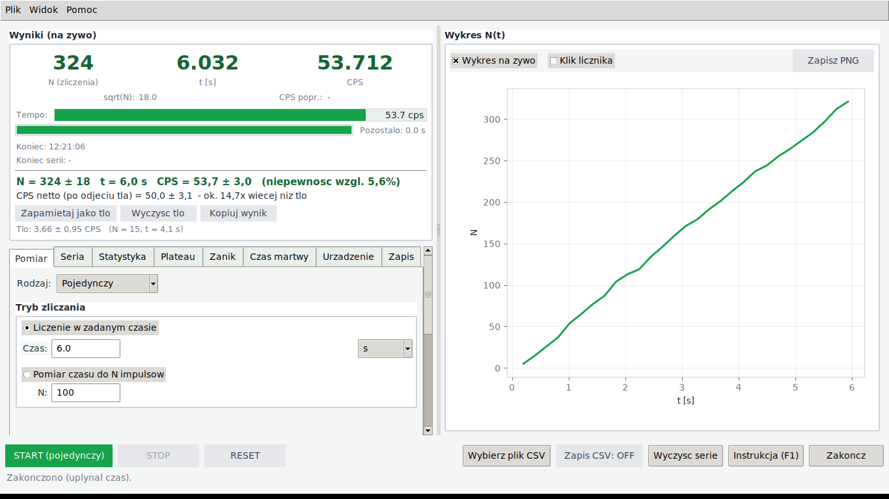
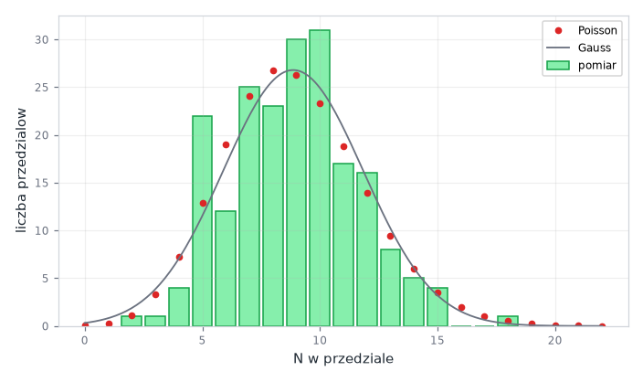

# GeigerApp – licznik Geigera-Müllera z kartą NI USB-6210

Program do ćwiczeń laboratoryjnych z promieniotwórczości. Zlicza impulsy z licznika
Geigera-Müllera przez sprzętowy licznik karty **NI USB-6210**, pokazuje wyniki na żywo
(od razu z niepewnościami) i prowadzi przez typowe ćwiczenia: tło, statystyka zliczeń,
plateau licznika, zanik promieniotwórczy i czas martwy.

Bez karty działa w **trybie symulatora**, więc obsługę można przećwiczyć na dowolnym komputerze.



## Co potrafi

- **Pomiar** w zadanym czasie albo do zadanej liczby impulsów. Wynik od razu z niepewnością,
  np. `N = 324 ± 18`, `CPS = 53,7 ± 3,0`, i przycisk „Kopiuj wynik” do sprawozdania.
- **Tło i wynik netto**: po pomiarze tła kliknij „Zapamiętaj jako tło”. Od tej chwili każdy
  wynik ma też CPS netto (po odjęciu tła) z niepewnością.
- **Seria** pomiarów z przerwami i tabelą wyników.
- **Statystyka**: histogram zliczeń z krzywymi Poissona i Gaussa oraz test χ² zgodności
  z rozkładem Poissona.
- **Plateau** licznika: CPS w funkcji napięcia i nachylenie plateau w %/100 V.
- **Zanik**: dopasowanie ważone niepewnościami, t½ i λ z niepewnością.
- **Czas martwy** metodą dwóch źródeł, z niepewnością. Jednym kliknięciem trafia do korekty
  „CPS popr.”.
- Zapis do **CSV** (kolejne pomiary są dopisywane, nic się nie nadpisuje), eksport tabel
  i wykresów do **CSV/PNG**.
- Wykrywanie kart NI, podpowiedzi po najechaniu myszą, instrukcja ćwiczeń pod **F1**,
  skrót **SPACJA** = START/STOP.



## Czego potrzebujesz

**Sprzęt**

- licznik (sonda) Geigera-Müllera z zasilaczem wysokiego napięcia,
- wzmacniacz/dyskryminator, który z impulsu licznika robi impuls logiczny **0…5 V (TTL)**,
- karta **NI USB-6210** podłączona przez USB.

**Oprogramowanie** (Windows 10/11)

| Co | Po co | Uwagi |
|---|---|---|
| Sterownik **NI-DAQmx** (zawiera program **NI MAX**) | obsługa karty | instalacja wymaga uprawnień administratora; w laboratorium zwykle już jest |
| **Python 3.9 lub nowszy** (np. z Anacondą) | uruchamianie programu | Anaconda jest zwykle już zainstalowana (np. razem ze Spyderem) |
| Paczki Pythona: `nidaqmx`, `matplotlib` | komunikacja z kartą, wykresy | instalowane jednym poleceniem, patrz niżej |

> **NI MAX / NI-DAQmx to nie jest paczka Pythona.** Sterownik instaluje się instalatorem NI,
> a paczkę `nidaqmx` (to, co jest w `import nidaqmx`) poleceniem `pip`. Do pracy z kartą
> potrzebne są **obie**.

## Instalacja krok po kroku (Windows)

### 1. Sterownik NI-DAQmx

Najpierw sprawdź, czy sterownik już jest: otwórz **NI MAX** i w *Devices and Interfaces*
poszukaj karty, np. **NI USB-6210 "Dev1"**. Karta jest widoczna? Kliknij *Self-Test*,
jeśli przejdzie, przejdź do kroku 2.

Jeśli sterownika nie ma, pobierz go ze strony NI:
<https://www.ni.com/en/support/downloads/drivers/download.ni-daq-mx.html>.
Instalacja wymaga administratora (na komputerze w pracowni poproś opiekuna/IT).

### 2. Python – użyj „Anaconda Prompt”

W menu Start wpisz **Anaconda Prompt** i otwórz. Wszystkie polecenia poniżej wpisuj
**tam**, a nie w zwykłym CMD/PowerShellu, bo zwykła konsola często nie widzi `python` ani `pip`.

Sprawdź:

```
python --version
pip --version
```

Nie masz Anacondy? Zainstaluj Pythona z <https://www.python.org/downloads/>. Da się to zrobić
bez administratora: wybierz *Customize installation*, **odznacz** *Install for all users*
i **zaznacz** *Add python.exe to PATH*. Potem polecenia wpisuj w nowym oknie CMD.

### 3. Pobierz program

Na stronie repozytorium na GitHubie kliknij **Code → Download ZIP** i rozpakuj,
najlepiej na **dysku lokalnym**, np. `C:\GeigerApp`. Dyski sieciowe i foldery synchronizowane
z OneDrive potrafią sprawiać problemy przy budowaniu `.exe`.

Z gitem: `git clone https://github.com/MateuszKowalczyk101/Elektronika.git`

### 4. Zainstaluj paczki Pythona

W Anaconda Prompt przejdź do folderu programu i zainstaluj paczki:

```
cd C:\GeigerApp
pip install -r requirements.txt
```

### 5. Uruchom

```
python geiger_gui.py
```

W zakładce **Urządzenie** powinien być napis **„NI-DAQ: Dev1 (USB-6210)”**. Jeśli jest inny
komunikat, program wyjaśnia, czego brakuje, a pomiary działają w trybie symulatora.

## Uruchamianie z pulpitu (plik .exe)

W Anaconda Prompt, w folderze programu:

```
build_exe.bat
```

Skrypt doinstaluje PyInstallera i zbuduje **`dist\GeigerApp.exe`** (jeden plik, z ikoną).
Skopiuj go na pulpit albo zrób do niego skrót (prawy klik → *Wyślij do → Pulpit*).

- `.exe` zawiera Pythona i paczki, ale **nie zawiera sterownika NI-DAQmx**. Na komputerze
  z kartą sterownik nadal musi być zainstalowany.
- Pierwsze uruchomienie trwa kilka sekund, bo program rozpakowuje się do folderu tymczasowego.
- Po każdej zmianie w `geiger_gui.py` zbuduj `.exe` od nowa.
- Własna ikona: podmień `assets\geiger.ico` (ikona pliku) i `assets\geiger.png` (ikona okna).

Ręcznie, bez skryptu:

```
pip install pyinstaller
python -m PyInstaller --onefile --windowed --name GeigerApp --icon assets\geiger.ico --add-data "assets\geiger.png;assets" --collect-all nidaqmx geiger_gui.py
```

## Podłączenie sygnału

```
sonda GM  ->  zasilacz WN + wzmacniacz/dyskryminator  ->  NI USB-6210: PFI 0 (sygnał) + D GND (masa)
```

- Na wejście karty musi iść **impuls logiczny 0…5 V** (próg ok. 1,4 V). Surowego impulsu
  z anody licznika nie podłączaj bezpośrednio: najpierw dyskryminator.
- Program domyślnie liczy zbocza narastające na liczniku `Dev1/ctr0` z wejścia `PFI0`.
  Inne wejście albo licznik ustawisz w zakładce **Urządzenie**.

## Jak używać

Instrukcja typowego ćwiczenia jest w programie: klawisz **F1** albo przycisk *Instrukcja (F1)*.
W skrócie:

| Zakładka | Do czego |
|---|---|
| Pomiar | pojedynczy pomiar (na czas albo do N impulsów), wybór rodzaju: Pojedynczy / Seria / Zanik |
| Seria | liczba pomiarów i przerwa, tabela wyników |
| Statystyka | histogram zliczeń, porównanie z rozkładem Poissona, test χ² |
| Plateau | CPS przy kolejnych napięciach WN (napięcie ustawiasz ręcznie na zasilaczu) |
| Zanik | t½ z serii pomiarów (np. Ba-137m); tło wypełnia się samo po „Zapamiętaj jako tło” |
| Czas martwy | metoda dwóch źródeł: źródło 1 → oba → źródło 2 |
| Urządzenie | wykryte karty, licznik i wejście PFI, symulator, czas martwy τ |
| Zapis | plik CSV z pomiarami |

Typowa kolejność: **tło** (300–500 s, bez źródła) → *Zapamiętaj jako tło* → **źródło**
→ odczytaj *CPS netto*.

## Pliki wynikowe

Pliki CSV otwierają się bezpośrednio w Excelu (polskie ustawienia): separator `;`,
przecinek dziesiętny, pierwsza linia `sep=;`. Linie zaczynające się od `#` opisują pomiar
(data, tryb, zapisane tło, wynik dopasowania itp.).

| Plik | Kolumny |
|---|---|
| pomiary (zakładka Zapis) | `run; t_s; N; sqrtN` (co 0,2 s i na koniec każdego pomiaru) |
| histogram | `przedzial; N` oraz tabela `N; liczba_przedzialow; oczekiwane_Poisson` |
| plateau | `U_V; N; t_s; CPS; err_CPS` |
| zanik | `t_mid_s; N; t_pomiaru_s; CPS; err_CPS; CPS_netto` |

## Rozwiązywanie problemów

| Problem | Rozwiązanie |
|---|---|
| `'pip'` / `'python'` / `'py' is not recognized` | Używaj **Anaconda Prompt**, nie zwykłego CMD. |
| Brak uprawnień administratora | Python: Anaconda albo python.org w trybie *Install for me only* (krok 2). Sterownik NI-DAQmx wymaga administratora. |
| „NI-DAQ: brak paczki nidaqmx” | `pip install -r requirements.txt` w **tym samym** Pythonie, którym uruchamiasz program. |
| „Could not find an installation of NI-DAQmx” | Nie ma sterownika NI-DAQmx, patrz krok 1. |
| NI MAX widzi kartę, program nie | Kliknij *Odśwież* w zakładce Urządzenie. Sprawdź, czy `nidaqmx` jest zainstalowane w tym samym Pythonie, którym uruchamiasz program. |
| „Błąd DAQ” po kliknięciu START | Karta zajęta przez inny program (np. otwarty *Test Panel* w NI MAX): zamknij go. Sprawdź też nazwę licznika w zakładce Urządzenie. |
| Zliczenia stoją na 0 | Sprawdź kabel na PFI 0 i masę, poziom sygnału 0…5 V i czy wybrane wejście PFI zgadza się z podłączeniem. |
| `The 'pathlib' package is an obsolete backport…` przy budowaniu `.exe` | `conda remove pathlib` (albo `pip uninstall pathlib`) i zbuduj ponownie. |
| `.exe` nie startuje / `ModuleNotFoundError` | Buduj przez `build_exe.bat` z dysku lokalnego. Przy starcie przez `python geiger_gui.py` widać pełny komunikat błędu. |
| W histogramie „pominięto przedziały” | Komputer nie nadążał z odczytem. Pominięte przedziały nie psują wyniku, tylko jest ich mniej. Zamknij inne programy albo wydłuż przedział. |

## Dla rozwijających program

Cały program to jeden plik `geiger_gui.py` (Tkinter + matplotlib). Obliczenia statystyczne
(rozkład Poissona, test χ², dopasowanie ważone, czas martwy) są napisane w czystym Pythonie,
bez numpy/scipy.

Testy (symulator, obliczenia i tryb karty NI na atrapie `nidaqmx`, więc bez karty):

```
pip install -r requirements-dev.txt
python -m pytest
```

## Struktura repozytorium

```
geiger_gui.py            program
requirements.txt         paczki potrzebne do uruchomienia
requirements-dev.txt     + pytest i PyInstaller (testy, budowanie .exe)
build_exe.bat            budowanie dist\GeigerApp.exe
assets/                  ikona programu (.ico dla pliku .exe, .png dla okna)
docs/                    zrzuty ekranu do tego pliku
tests/                   testy (pytest) i atrapa paczki nidaqmx
archiwum/                starszy program do pomiaru napięcia (AI0/AI1), niepotrzebny do licznika GM
```
